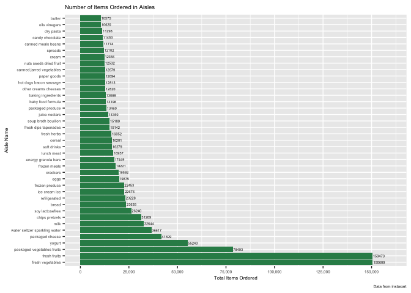

HW3 - Visualization
================
Holly Finertie
10/14/2019

# Problem1

``` r
library(tidyverse)
```

    ## ── Attaching packages ──────────────────────────────────────────────────────────────── tidyverse 1.2.1 ──

    ## ✔ ggplot2 3.2.1     ✔ purrr   0.3.2
    ## ✔ tibble  2.1.3     ✔ dplyr   0.8.3
    ## ✔ tidyr   1.0.0     ✔ stringr 1.4.0
    ## ✔ readr   1.3.1     ✔ forcats 0.4.0

    ## ── Conflicts ─────────────────────────────────────────────────────────────────── tidyverse_conflicts() ──
    ## ✖ dplyr::filter() masks stats::filter()
    ## ✖ dplyr::lag()    masks stats::lag()

``` r
library(p8105.datasets)
data("instacart")
```

## Description of Instacart Data Set:

This data set contains 1384617 observations and 15 variables describing
order information like time and day order was placed, products ordered,
aisle where products are located, and days since last order was placed
per user id. For example, the individual with user id 5 ordered 9 items
of which most were from the produce department. They placed this order 6
days after their last order.

In total, there are 134 aisles and the most items are ordered from the
fresh vegetables.

## Plot of Items Ordered

``` r
plot_aisles = instacart %>% 
  count(aisle, name = "n_aisle") %>% 
  filter(n_aisle > 10000) %>% 
  arrange(desc(aisle)) %>% 
  mutate(
    aisle = str_to_title(aisle)
  ) %>% 
  ggplot(aes(x = aisle, y = n_aisle)) +
  geom_bar(stat ="identity") + 
  geom_text(aes(label = n_aisle), hjust=-0.05, size = 1.5) +
  labs(
    title = "Number of Items Ordered in Aisles",
    x = "Aisle Name",
    y = "Total Items Ordered",
    caption = "Data from instacart") +
  scale_y_continuous(limits = c(0, 160000)) +
  theme(text = element_text(size=7))
  

plot_aisles + coord_flip()
```

<!-- -->

## Most Popular Items in Each Row

``` r
top3_products = instacart %>% 
  select(aisle, product_name) %>% 
  filter(
    aisle == "baking ingredients" | 
    aisle == "dog food care" | 
    aisle == "packaged vegetables fruits") %>% 
  group_by(aisle) %>% 
  count(product_name, name = "n_product") %>% 
  filter(min_rank(desc(n_product)) < 4) %>% 
  knitr::kable()

top3_products
```

| aisle                      | product\_name                                 | n\_product |
| :------------------------- | :-------------------------------------------- | ---------: |
| baking ingredients         | Cane Sugar                                    |        336 |
| baking ingredients         | Light Brown Sugar                             |        499 |
| baking ingredients         | Pure Baking Soda                              |        387 |
| dog food care              | Organix Chicken & Brown Rice Recipe           |         28 |
| dog food care              | Small Dog Biscuits                            |         26 |
| dog food care              | Snack Sticks Chicken & Rice Recipe Dog Treats |         30 |
| packaged vegetables fruits | Organic Baby Spinach                          |       9784 |
| packaged vegetables fruits | Organic Blueberries                           |       4966 |
| packaged vegetables fruits | Organic Raspberries                           |       5546 |
