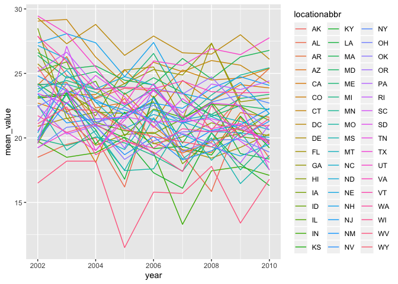
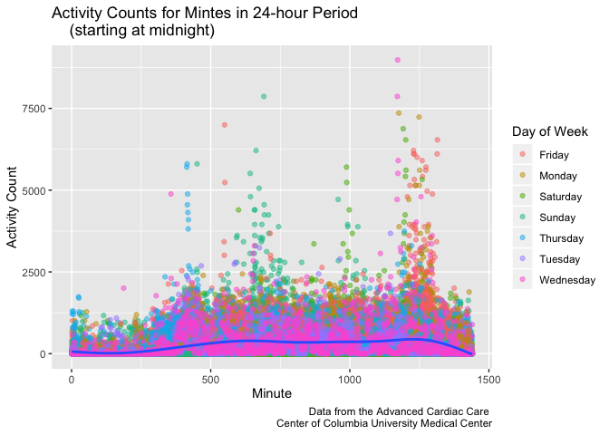

HW3 - Visualization
================
Holly Finertie
10/14/2019

# Problem1

``` r
library(tidyverse)
```

    ## ── Attaching packages ────────────────────────────────────────────── tidyverse 1.2.1 ──

    ## ✔ ggplot2 3.2.1     ✔ purrr   0.3.2
    ## ✔ tibble  2.1.3     ✔ dplyr   0.8.3
    ## ✔ tidyr   1.0.0     ✔ stringr 1.4.0
    ## ✔ readr   1.3.1     ✔ forcats 0.4.0

    ## ── Conflicts ───────────────────────────────────────────────── tidyverse_conflicts() ──
    ## ✖ dplyr::filter() masks stats::filter()
    ## ✖ dplyr::lag()    masks stats::lag()

``` r
library(p8105.datasets)
data("instacart")
```

### Description of Instacart Data Set:

This data set contains `1384617 observations` and `15 variables`
describing order information like time and day order was placed,
products ordered, aisle where products are located, and days since last
order was placed per user id. For example, the individual with user id 5
ordered 9 items of which most were from the produce department. They
placed this order 6 days after their last order.

In total, there are `134 aisles` and the most ordered items are from the
`fresh vegetables aisle`.

### Plot of Items Ordered

``` r
plot_aisles = instacart %>% 
  count(aisle, name = "n_aisle") %>% 
  filter(n_aisle > 10000) %>% 
  arrange((n_aisle)) %>% 
  ggplot(aes(x = reorder(aisle, -n_aisle), y = n_aisle)) +
  geom_bar(stat = "identity") + 
  geom_text(aes(label = n_aisle), hjust = -0.05, size = 1.5) +
  labs(
    title = "Number of Items Ordered in Aisles",
    x = "Aisle Name",
    y = "Total Items Ordered",
    caption = "Data from instacart") +
  scale_y_continuous(
    breaks = c(0, 25000, 50000, 75000, 100000, 125000, 150000), 
    labels = c("0", "25,000", "50,000", "75,000", "100,000", "125,000", "150,000"),
    limits = c(0, 160000)) +
  theme(text = element_text(size = 7))

plot_aisles + coord_flip()
```

<!-- -->

### Most Popular Items in Each Aisle Row

``` r
top3_products = instacart %>% 
  select(aisle, product_name) %>% 
  filter(
    aisle == "baking ingredients" | 
    aisle == "dog food care" | 
    aisle == "packaged vegetables fruits") %>% 
  group_by(aisle) %>% 
  count(product_name, name = "n_product") %>% 
  filter(min_rank(desc(n_product)) < 4) %>% 
  arrange(desc(n_product)) %>%
  mutate(
    product_name = str_to_lower(product_name), 
    "Rank" = row_number()) %>%
  rename(
    "Aisle Name" = aisle,
    "Product Name" = product_name, 
    "Count" = n_product
  ) %>% 
  select( "Rank", everything()) %>% 
  knitr::kable()

top3_products
```

| Rank | Aisle Name                 | Product Name                                  | Count |
| ---: | :------------------------- | :-------------------------------------------- | ----: |
|    1 | packaged vegetables fruits | organic baby spinach                          |  9784 |
|    2 | packaged vegetables fruits | organic raspberries                           |  5546 |
|    3 | packaged vegetables fruits | organic blueberries                           |  4966 |
|    1 | baking ingredients         | light brown sugar                             |   499 |
|    2 | baking ingredients         | pure baking soda                              |   387 |
|    3 | baking ingredients         | cane sugar                                    |   336 |
|    1 | dog food care              | snack sticks chicken & rice recipe dog treats |    30 |
|    2 | dog food care              | organix chicken & brown rice recipe           |    28 |
|    3 | dog food care              | small dog biscuits                            |    26 |

### Mean Time of Day Pink Lady Apples and Coffee Ice Cream Are Ordered by Day

``` r
apples_and_cream = instacart %>% 
  filter(product_name == "Pink Lady Apples" | product_name == "Coffee Ice Cream") %>% 
  group_by(order_dow, product_name) %>% 
  summarize(mean_time = mean(order_hour_of_day)) %>% 
  separate(
    mean_time, 
    into = c("hour", "minute"), sep = 2) %>%
  ungroup(order_dow) %>% 
  mutate(order_dow = recode(order_dow, 
         `0` = "Monday", 
         `1` = "Tuesday", 
         `2` = "Wednesday", 
         `3` = "Thursday",
         `4` = "Friday", 
         `5` = "Saturday",
         `6` = "Sunday"), 
      hour = as.numeric(hour),
      minute = as.numeric(minute),
      ave_hour = ifelse(hour>12,(hour-12), hour),
      minute = round((minute*60), digits = 0), 
      mean_time = 
        ifelse((hour>12), paste(ave_hour,":",minute, "pm"), 
      paste(ave_hour, ":",minute, "am"))) %>% 
  select(order_dow, product_name, mean_time) %>% 
  pivot_wider(
    names_from = "product_name", 
    values_from = "mean_time"
  ) %>% 
  rename("Day of Week" = order_dow) %>% 
  knitr::kable()
apples_and_cream
```

| Day of Week | Coffee Ice Cream | Pink Lady Apples |
| :---------- | :--------------- | :--------------- |
| Monday      | 1 : 46 pm        | 1 : 26 pm        |
| Tuesday     | 2 : 19 pm        | 11 : 22 am       |
| Wednesday   | 3 : 23 pm        | 11 : 42 am       |
| Thursday    | 3 : 19 pm        | 2 : 15 pm        |
| Friday      | 3 : 13 pm        | 11 : 33 am       |
| Saturday    | 12 : 16 am       | 12 : 47 am       |
| Sunday      | 1 : 50 pm        | 11 : 56 am       |

# Problem 2

### Data Cleaning

``` r
library(p8105.datasets)
data("brfss_smart2010")

brfss_smart2010 = brfss_smart2010 %>% 
  janitor::clean_names() %>% 
  filter(topic == "Overall Health") %>% 
  mutate(response = forcats::fct_relevel(response, c("Poor", "Fair","Good", "Very good", "Excellent")))
```

### States with 7 or More Observed Locations (2002 and 2010)

``` r
states_2002 = brfss_smart2010 %>% 
  filter(year == 2002) %>% 
  group_by(locationabbr) %>% 
  summarize(n_location = n_distinct(locationdesc)) %>% 
  filter(n_location >= 7) %>% 
  rename(
    "State" = locationabbr, 
    "Number of Locations" = n_location
  ) %>% 
  knitr::kable()

states_2002
```

| State | Number of Locations |
| :---- | ------------------: |
| CT    |                   7 |
| FL    |                   7 |
| MA    |                   8 |
| NC    |                   7 |
| NJ    |                   8 |
| PA    |                  10 |

  - Connecticut, Florida, Massachusetts, North Carolina, New Jersey and
    Pennsylvania had 7 or more locations in 2002.

<!-- end list -->

``` r
states_2010 = brfss_smart2010 %>% 
  filter(year == 2010) %>% 
  group_by(locationabbr) %>% 
  summarize(n_location = n_distinct(locationdesc)) %>% 
  filter(n_location >= 7) %>% 
  rename(
    "State" = locationabbr, 
    "Number of Locations" = n_location
  ) %>% 
  knitr::kable()

states_2010
```

| State | Number of Locations |
| :---- | ------------------: |
| CA    |                  12 |
| CO    |                   7 |
| FL    |                  41 |
| MA    |                   9 |
| MD    |                  12 |
| NC    |                  12 |
| NE    |                  10 |
| NJ    |                  19 |
| NY    |                   9 |
| OH    |                   8 |
| PA    |                   7 |
| SC    |                   7 |
| TX    |                  16 |
| WA    |                  10 |

  - California, Colorado, Florida, Massachusetts, Maryland, North
    Carolina, Nebraska, New Jersey, New York, Ohio, Pennsylvania, South
    Carolina, Texas, and Washington had 7 or more locations in 2010.

### Spaghetti Plot: Average Data Value Over Time by State

``` r
brfss_excellent = brfss_smart2010  %>% 
  filter(topic == "Overall Health" & response == "Excellent") %>% 
  group_by(year, locationabbr) %>% 
  mutate(
    mean_value = mean(data_value, na.rm = TRUE)) %>% 
  select(year, locationabbr, mean_value) %>% 
  distinct() %>% 
  ggplot(aes(x = year, y = mean_value)) +
  geom_line(aes(group = locationabbr, color = locationabbr)) +
  labs(
    title = "Average Data Value for Excellent Responses",
    x = "Year",
    y = "Average Data Value",
    caption = "Data from BRFSS") +
  scale_color_hue(name = "State")

brfss_excellent
```

<!-- -->

### 2 Panel Plot for Distribution of Data Values in NY by 2006 and 2010

``` r
brfss_ny_state = brfss_smart2010 %>% 
  filter((year == 2010 | year == 2006) & locationabbr == "NY") %>% 
  mutate(locationdesc = substr(locationdesc, 6, 10000)) %>% 
  ggplot(aes(x = locationdesc, y = data_value, fill = response)) + 
  geom_bar(stat = "identity", position = "dodge") +
  facet_grid(~year) +
  theme(axis.text.x = element_text(angle = 90, hjust = 1)) + 
  labs(
    title = "Distribution of Data Values in NY",
    x = "NY County",
    y = "Data Value",
    caption = "Data from BRFSS") +
  scale_color_hue(name = "Response Category")
  

brfss_ny_state
```

<!-- -->

# Problem 3

### Data Tidying

``` r
accel_data = read_csv("./data/accel_data.csv") %>% 
  janitor::clean_names() %>% 
  pivot_longer(
    activity_1:activity_1440, 
    names_to = "activity_minute", 
    values_to = "activity_count") %>% 
  separate(
    activity_minute, 
    into = c("activity", "activity_minute"), sep = 9) %>% 
  mutate(
    day_type = case_when(
          (day == "Saturday" | day == "Sunday") ~ "Weekend", 
          TRUE ~ "Weekday"), 
    activity_minute = as.integer(activity_minute)) %>% 
  select(-activity)
```

    ## Parsed with column specification:
    ## cols(
    ##   .default = col_double(),
    ##   day = col_character()
    ## )

    ## See spec(...) for full column specifications.

### Describe Data Set

This data set contains 50400 observations and 6 variables describing
five weeks of accelerometer data collected on a 63 year-old male with
BMI 25, who was diagnosed with congestive heart failure (CHF). Variables
include information on acitivity count `(activity_count)` for every
minute `(activity_minute)` in a 24 hour period by day `(day_id)` for 5
weeks.

### Total Activity by Day

``` r
total_activity = accel_data %>% 
  group_by(day_id) %>% 
  summarize("Total Activity" = sum(activity_count)) %>% 
  ungroup(day_id) %>% 
  rename("Day" = day_id) %>% 
  knitr::kable()

total_activity
```

| Day | Total Activity |
| --: | -------------: |
|   1 |      480542.62 |
|   2 |       78828.07 |
|   3 |      376254.00 |
|   4 |      631105.00 |
|   5 |      355923.64 |
|   6 |      307094.24 |
|   7 |      340115.01 |
|   8 |      568839.00 |
|   9 |      295431.00 |
|  10 |      607175.00 |
|  11 |      422018.00 |
|  12 |      474048.00 |
|  13 |      423245.00 |
|  14 |      440962.00 |
|  15 |      467420.00 |
|  16 |      685910.00 |
|  17 |      382928.00 |
|  18 |      467052.00 |
|  19 |      371230.00 |
|  20 |      381507.00 |
|  21 |      468869.00 |
|  22 |      154049.00 |
|  23 |      409450.00 |
|  24 |        1440.00 |
|  25 |      260617.00 |
|  26 |      340291.00 |
|  27 |      319568.00 |
|  28 |      434460.00 |
|  29 |      620860.00 |
|  30 |      389080.00 |
|  31 |        1440.00 |
|  32 |      138421.00 |
|  33 |      549658.00 |
|  34 |      367824.00 |
|  35 |      445366.00 |

  - I would argue that there are no apparent trends across the total
    activity for 35 days.

### Total Activity over the course of a Day

``` r
activity_plot = accel_data %>% 
  group_by(activity_minute, day) %>% 
  summarize(mean_activity = mean(activity_count)) %>% 
ggplot(aes(x = activity_minute, y = mean_activity)) +
  geom_line(aes(color = day), alpha = 0.4) +
  geom_smooth(se = FALSE, alpha = 0.4) +
  labs(
    title = "Activity Counts for Mintes in 24-hour Period",
    x = "Minute",
    y = "Activity Count",
    caption = "Data from the Advanced Cardiac Care 
    Center of Columbia University Medical Center"
  ) +
  scale_color_hue(name = "Day of Week") +
   scale_x_continuous(
    breaks = c(0, 180, 360, 540, 720, 900, 1080, 1260, 1440), 
    labels = c("00:00","03:00", "06:00", "09:00","12:00", "15:00", "18:00", "21:00", "24:00"),
    limits = c(0, 1440))

activity_plot
```

    ## `geom_smooth()` using method = 'gam' and formula 'y ~ s(x, bs = "cs")'

<!-- -->

  - The lowest activity points are around 3:00 and 24:00, while the
    highest activity points occur around 10:00 and 21:00 across all
    days. There are peaks at 10:00 on Sundays and 21:00 on Fridays close
    to 2,000. But on average, the activity count stays under 500.
