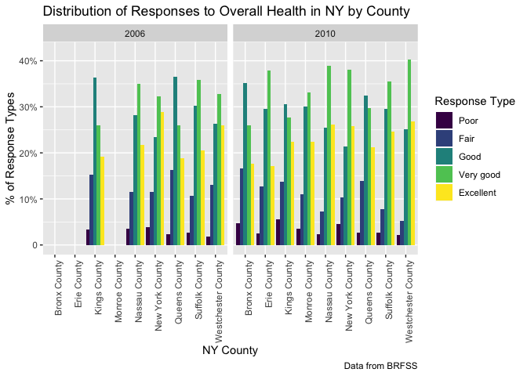
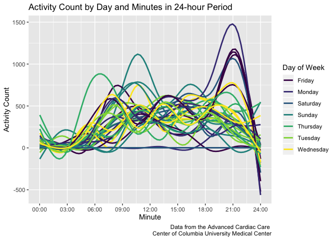

HW3 - Visualization
================
Holly Finertie
10/14/2019

# Problem1

``` r
library(tidyverse)
```

    ## ── Attaching packages ───────────────────────────────────── tidyverse 1.2.1 ──

    ## ✔ ggplot2 3.2.1     ✔ purrr   0.3.2
    ## ✔ tibble  2.1.3     ✔ dplyr   0.8.3
    ## ✔ tidyr   1.0.0     ✔ stringr 1.4.0
    ## ✔ readr   1.3.1     ✔ forcats 0.4.0

    ## ── Conflicts ──────────────────────────────────────── tidyverse_conflicts() ──
    ## ✖ dplyr::filter() masks stats::filter()
    ## ✖ dplyr::lag()    masks stats::lag()

``` r
library(p8105.datasets)
data("instacart")
```

### Description of Instacart Data Set

This data set “Instacart” contains `1384617 observations` and `15
variables` describing order information like time and day order was
placed, products ordered, aisle where products are located, and days
since last order was placed per user id. For example, the individual
with user id 5 ordered 9 items of which most were from the produce
department. They placed this order 6 days after their last order.

In total, there are `134 aisles` and the most ordered items are from the
`fresh vegetables aisle`.

### Plot of Items Ordered

``` r
plot_aisles = instacart %>% 
  count(aisle, name = "n_aisle") %>% 
  filter(n_aisle > 10000) %>% 
  arrange((n_aisle)) %>% 
  ggplot(aes(x = reorder(aisle, -n_aisle), y = n_aisle)) +
  geom_bar(stat = "identity", fill = "seagreen4") + 
  geom_text(aes(label = n_aisle), hjust = -0.05, size = 1.5) +
  labs(
    title = "Number of Items Ordered in Aisles",
    x = "Aisle Name",
    y = "Total Items Ordered",
    caption = "Data from instacart") +
  scale_y_continuous(
    breaks = c(0, 25000, 50000, 75000, 100000, 125000, 150000), 
    labels = c("0", "25,000", "50,000", "75,000", "100,000", "125,000", "150,000"),
    limits = c(0, 160000)) +
  theme(text = element_text(size = 6))

plot_aisles + coord_flip()
```

<!-- -->

### Most Popular Items in Each Aisle Row

``` r
top3_products = instacart %>% 
  select(aisle, product_name) %>% 
  filter(
    aisle == "baking ingredients" | 
    aisle == "dog food care" | 
    aisle == "packaged vegetables fruits") %>% 
  mutate(aisle = str_to_title(aisle)) %>% 
  group_by(aisle) %>% 
  count(product_name, name = "n_product") %>% 
  filter(min_rank(desc(n_product)) < 4) %>% 
  arrange(desc(n_product)) %>%
  mutate(
    "Rank" = row_number(),
    n_product = paste(product_name, n_product, sep = ", n = ")) %>% 
  select( "Rank", "aisle", "n_product") %>% 
  pivot_wider(
    names_from = "aisle", 
    values_from = "n_product"
  ) %>% 
  knitr::kable()

top3_products
```

| Rank | Packaged Vegetables Fruits     | Baking Ingredients         | Dog Food Care                                         |
| ---: | :----------------------------- | :------------------------- | :---------------------------------------------------- |
|    1 | Organic Baby Spinach, n = 9784 | Light Brown Sugar, n = 499 | Snack Sticks Chicken & Rice Recipe Dog Treats, n = 30 |
|    2 | Organic Raspberries, n = 5546  | Pure Baking Soda, n = 387  | Organix Chicken & Brown Rice Recipe, n = 28           |
|    3 | Organic Blueberries, n = 4966  | Cane Sugar, n = 336        | Small Dog Biscuits, n = 26                            |

### Mean Time of Day Pink Lady Apples and Coffee Ice Cream Are Ordered by Day

``` r
apples_and_cream = instacart %>% 
  filter(
    product_name == "Pink Lady Apples" | 
    product_name == "Coffee Ice Cream") %>% 
  group_by(order_dow, product_name) %>% 
  summarize(mean_time = mean(order_hour_of_day)) %>% 
  separate(
    mean_time, 
    into = c("hour", "minute"), sep = 2) %>%
  ungroup(order_dow) %>% 
  mutate(order_dow = recode(order_dow, 
         `0` = "Sunday",
         `1` = "Monday", 
         `2` = "Tuesday", 
         `3` = "Wednesday", 
         `4` = "Thursday",
         `5` = "Friday", 
         `6` = "Saturday"), 
      hour = as.numeric(hour),
      minute = as.numeric(minute),
      minute = round((minute*60), digits = 0), 
      mean_time = paste(hour, minute, sep = ":")) %>% 
  select(order_dow, product_name, mean_time) %>% 
  pivot_wider(
    names_from = "order_dow", 
    values_from = "mean_time"
  ) %>% 
  rename("Product Name" = product_name) %>% 
  knitr::kable()

apples_and_cream
```

| Product Name     | Sunday | Monday | Tuesday | Wednesday | Thursday | Friday | Saturday |
| :--------------- | :----- | :----- | :------ | :-------- | :------- | :----- | :------- |
| Coffee Ice Cream | 13:46  | 14:19  | 15:23   | 15:19     | 15:13    | 12:16  | 13:50    |
| Pink Lady Apples | 13:26  | 11:22  | 11:42   | 14:15     | 11:33    | 12:47  | 11:56    |

  - Worked under the assumption that 0 = Sunday\!

# Problem 2

### Data Cleaning

``` r
library(p8105.datasets)
data("brfss_smart2010")

brfss_smart2010 = brfss_smart2010 %>% 
  janitor::clean_names() %>% 
  filter(topic == "Overall Health") %>% 
  mutate(response = forcats::fct_relevel(response, c("Poor", "Fair","Good", "Very good", "Excellent")))
```

### States with 7 or More Observed Locations in 2002 and 2010

``` r
state_locations = brfss_smart2010 %>% 
  filter(year == 2002 | year == 2010) %>% 
  group_by(locationabbr, year) %>% 
  summarize(n_location = n_distinct(locationdesc)) %>% 
  filter(n_location >= 7) %>% 
  rename(
    "State" = locationabbr, 
    "Number of Locations" = n_location
  ) 
```

  - In 2002, there were 6 states with 7 or more locations were: CT, FL,
    MA, NC, NJ, PA.

  - In 2010, there were 14 states with 7 or more locations were: CA, CO,
    FL, MA, MD, NC, NE, NJ, NY, OH, PA, SC, TX, WA.

### Spaghetti Plot: Average Percent of Excellent Responses

``` r
brfss_excellent = brfss_smart2010  %>% 
  filter(topic == "Overall Health" & response == "Excellent") %>% 
  group_by(year, locationabbr) %>% 
  mutate(
    mean_value = mean(data_value, na.rm = TRUE)) %>% 
  select(year, locationabbr, mean_value) %>% 
  distinct() %>% 
  ggplot(aes(x = year, y = mean_value)) +
  geom_line(aes(group = locationabbr, color = locationabbr)) +
  labs(
    title = "Average Percent of Respondents with Excellent Overall Health",
    x = "Year",
    y = "Average %",
    caption = "Data from BRFSS") +
   scale_y_continuous(
    breaks = c(10, 20, 30), 
    labels = c("10%", "20%", "30%"),
    limits = c(10, 30)) +
  viridis::scale_color_viridis(
    name = "State", 
    discrete = TRUE
  )

brfss_excellent
```

<!-- -->

### 2 Panel Plot for Distribution of Response Types in NY by 2006 and 2010

``` r
brfss_ny_state = brfss_smart2010 %>% 
  filter((year == 2010 | year == 2006) & locationabbr == "NY") %>% 
  mutate(
    locationdesc = substr(locationdesc, 6, 10000)) %>% 
  ggplot(aes(x = locationdesc, y = data_value, fill = response)) + 
  geom_bar(stat = "identity", position = "dodge") +
  facet_grid(~year) +
  theme(axis.text.x = element_text(angle = 90, hjust = 1)) + 
  labs(
    title = "Distribution of Responses to Overall Health in NY by County",
    x = "NY County",
    y = "% of Response Types",
    caption = "Data from BRFSS") +
   scale_y_continuous(
    breaks = c(0, 10, 20, 30, 40), 
    labels = c("0", "10%", "20%", "30%", "40%"),
    limits = c(0, 42)) +
  viridis::scale_fill_viridis(
    name = "Response Type", 
    discrete = TRUE
  )
  
brfss_ny_state
```

<!-- -->

# Problem 3

### Data Tidying

``` r
accel_data = read_csv("./data/accel_data.csv") %>% 
  janitor::clean_names() %>% 
  pivot_longer(
    activity_1:activity_1440, 
    names_to = "activity_minute", 
    names_prefix = "activity_",
    values_to = "activity_count") %>% 
  mutate(
    day_type = case_when(
          (day == "Saturday" | day == "Sunday") ~ "Weekend", 
          TRUE ~ "Weekday"), 
    activity_minute = as.integer(activity_minute))
```

    ## Parsed with column specification:
    ## cols(
    ##   .default = col_double(),
    ##   day = col_character()
    ## )

    ## See spec(...) for full column specifications.

### Describe Data Set

This data set contains 50400 observations and 6 variables describing
five weeks of accelerometer data collected on a 63 year-old male with
BMI 25, who was diagnosed with congestive heart failure (CHF). Variables
include information on acitivity count `(activity_count)` for every
minute `(activity_minute)` in a 24 hour period by day `(day_id)` for 5
weeks.

### Total Activity by Day

``` r
total_activity = accel_data %>% 
  group_by(day_id) %>% 
  summarize("Total Activity" = sum(activity_count)) %>% 
  ungroup(day_id) %>% 
  rename("Day" = day_id) %>% 
  knitr::kable()

total_activity
```

| Day | Total Activity |
| --: | -------------: |
|   1 |      480542.62 |
|   2 |       78828.07 |
|   3 |      376254.00 |
|   4 |      631105.00 |
|   5 |      355923.64 |
|   6 |      307094.24 |
|   7 |      340115.01 |
|   8 |      568839.00 |
|   9 |      295431.00 |
|  10 |      607175.00 |
|  11 |      422018.00 |
|  12 |      474048.00 |
|  13 |      423245.00 |
|  14 |      440962.00 |
|  15 |      467420.00 |
|  16 |      685910.00 |
|  17 |      382928.00 |
|  18 |      467052.00 |
|  19 |      371230.00 |
|  20 |      381507.00 |
|  21 |      468869.00 |
|  22 |      154049.00 |
|  23 |      409450.00 |
|  24 |        1440.00 |
|  25 |      260617.00 |
|  26 |      340291.00 |
|  27 |      319568.00 |
|  28 |      434460.00 |
|  29 |      620860.00 |
|  30 |      389080.00 |
|  31 |        1440.00 |
|  32 |      138421.00 |
|  33 |      549658.00 |
|  34 |      367824.00 |
|  35 |      445366.00 |

  - I would argue that there are no apparent trends across the total
    activity for 35 days.

### Activity by Minute by Day

``` r
activity_plot = accel_data %>% 
  group_by(day_id, day, activity_minute) %>% 
  select(day_id, day, activity_minute, activity_count) %>% 
ggplot(aes(x = activity_minute, y = activity_count, group = day_id, color = day)) +
  geom_smooth(se = FALSE) +
  labs(
    title = "Activity Count by Day and Minutes in 24-hour Period",
    x = "Minute",
    y = "Activity Count",
    caption = "Data from the Advanced Cardiac Care 
    Center of Columbia University Medical Center"
  ) +
  viridis::scale_color_viridis(
    name = "Day of Week", 
    discrete = TRUE
  ) +
   scale_x_continuous(
    breaks = c(0, 180, 360, 540, 720, 900, 1080, 1260, 1440), 
    labels = c("00:00","03:00", "06:00", "09:00","12:00", "15:00", "18:00", "21:00", "24:00"),
    limits = c(0, 1440)) 

activity_plot
```

    ## `geom_smooth()` using method = 'gam' and formula 'y ~ s(x, bs = "cs")'

<!-- -->

  - The lowest activity points for all days are from 2:00-4:00 and at
    24:00, while the highest activity points occur around 10:00 on
    Sundays and 21:00 on Mondays, Fridays, and Saturdays. On average,
    the activity count stays around 500.
